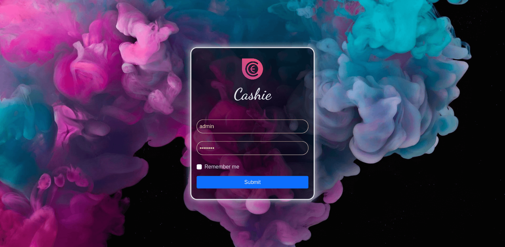
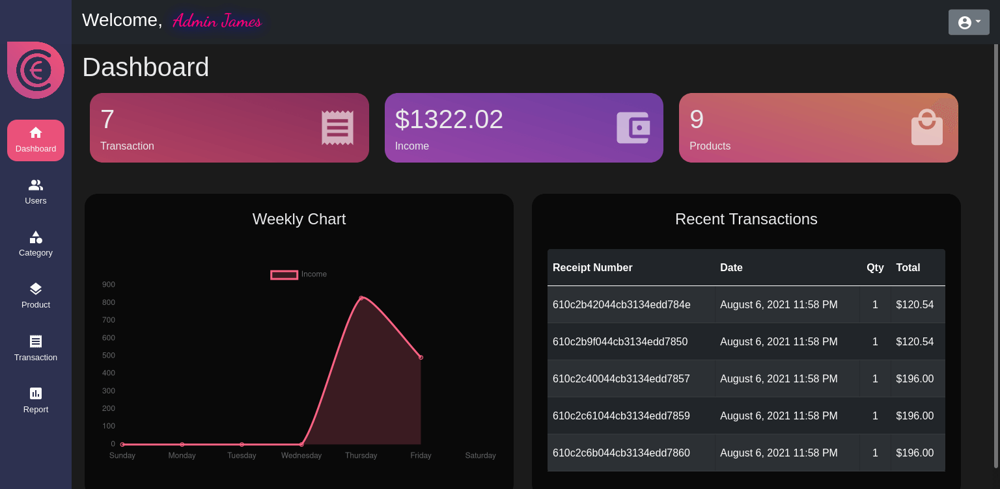

# Cashie

Frontend Point of Sale application built with:
 

This application has following sections:

### 1) Login Page

### 2) Dashboard Page

The site provides two different interfaces for users who are categorised either as:
- Cashier
	Can Access
		- Dashboard
		- Product
		- Transaction

- Admin
	Can access all tabs

User can
	- Check dashboard
	- Create Categories and respective Products
	- Checkout items to cart
	- Make transactions
	- Print transaction receipt
	- Can set tax and discount to provide on products

Additional Features
	- Search and sort to filter Users, Categories, Products, and Report
	- Validating form input for creating/updating
		- User
		- Product
		- Category
		- Product
