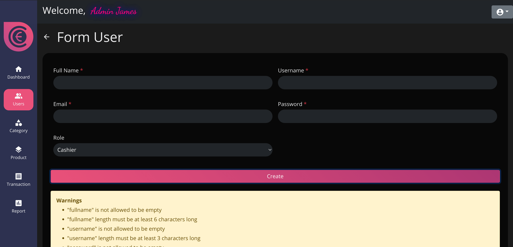
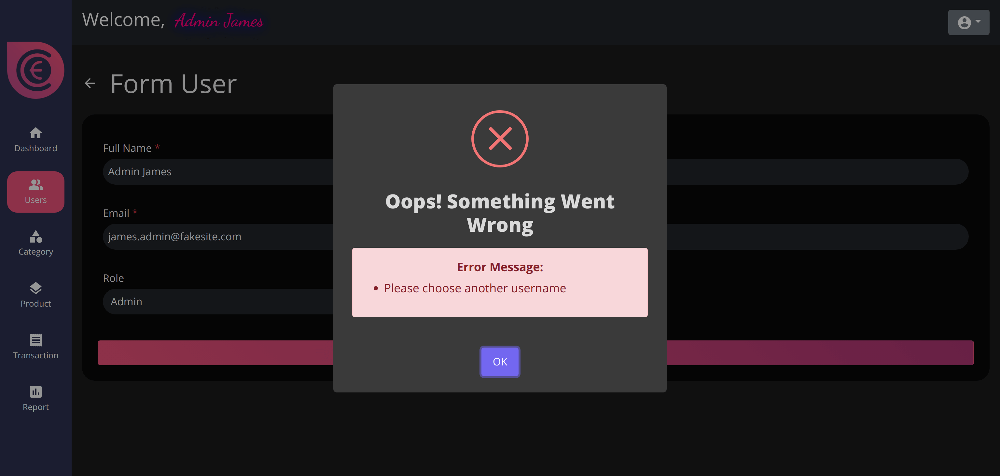
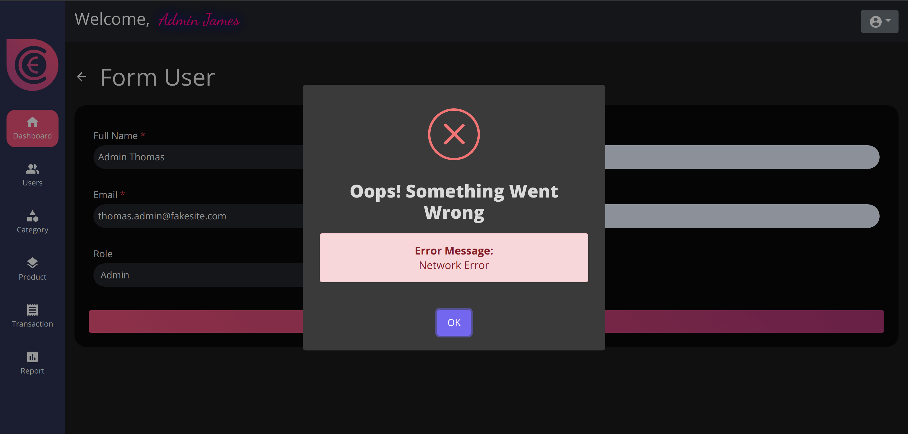

# Cashie

Frontend Point of Sale application built with:

 

This application has the following sections:

### 1) Login Page


### 2) Dashboard Page


## Site Features

### 1) User roles
This provides two roles that can be assigned to the user
#### - Admin
> Has access to all the sections, with create, edit and remove privilege

#### - Cashier
> Has access to only Dashboard, Product and Transaction page

### 2) User Section
- Create, Edit, Remove and Provide roles (Admin / Cashier) to new and existing users
- Search sort user list based on name, role, newest, oldest and last active

### 3) Category, Product Lists Section
- Search, the sort option
- Create, update and remove

### 4) Transaction Section
- Add to cart
- Increase Quantity of products put in the cart
- Presenting products on category based
- Make transactions

### 5) Reports Section
- Check old transactions
- Print transaction receipt

### 6) Settings and Account Section (Provided on Header Bar)
- Change store name, discount on products and tax
- Update account info

## Few important things provided

### 1) Displaying validation report


### 2) Displaying server message on backend side errors


### 3) Displaying system errors


# TO RUN ON LOCAL MACHINE
## Frontend
- Install npm
- Go to front end directory
- Enter the following command to install node modules and start the local server
```
npm install
npm start
```

## Backend
- Need to install MongoDB COMMUNITY EDITION and MongoDB compass. Click this link to see instructions to install on different OS. [LINK](https://docs.mongodb.com/manual/installation/)
- Once both get installed open MongoDB compass and click connect button
- Go to the backend folder inside the project folder and run the following command
```
npm install
npm start
```
- You can access the dashboard with the following credentials
> Username: cashieadmin
> Password: cashieadmin

After running the Frontend, if the site didn't display automatically on the default browser, then enter the following link in a new tab:
```
localhost:3000
```
